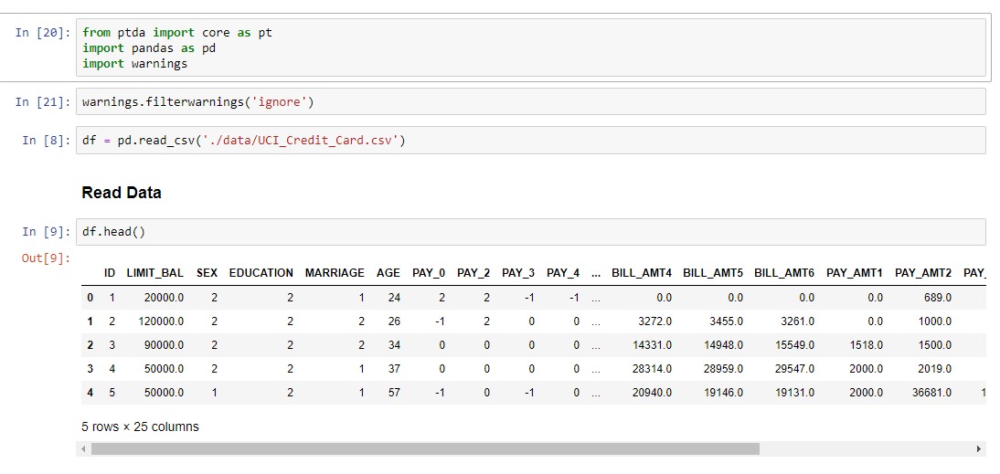
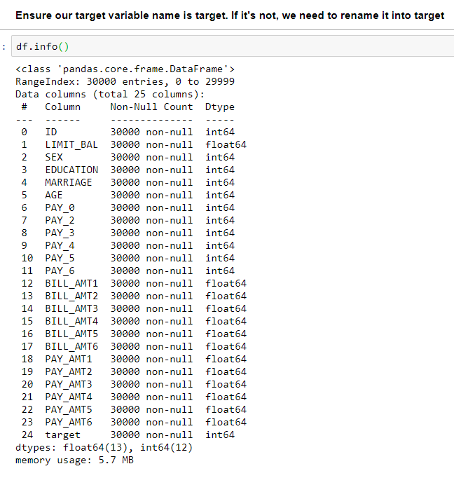
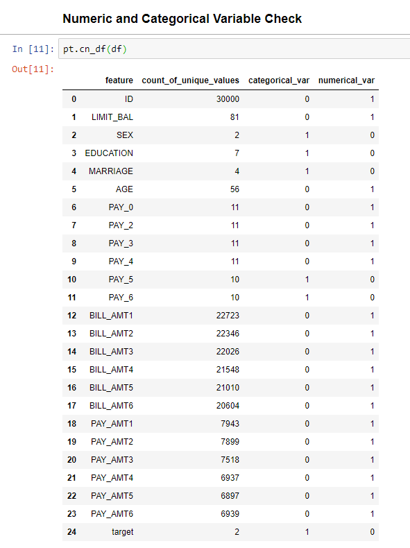
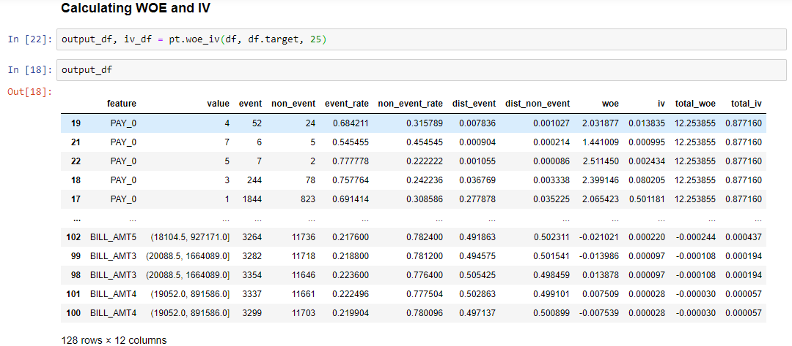
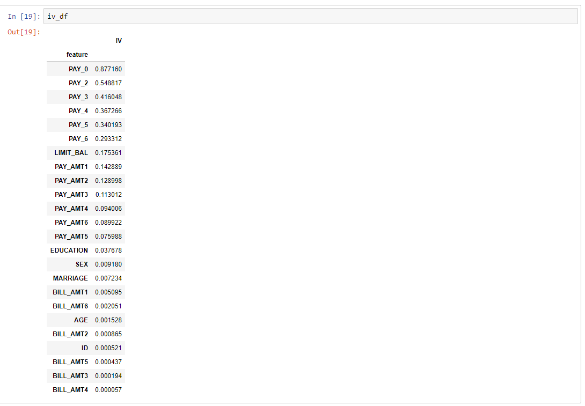

# PtDa

# Python package for data analytics.

## The package provides:
- WOE calculation
- IV calculation
- Numeric and categorical check
- etc

## How to get it?
Binary installers for the latest released version are available at the [Python package index](https://pypi.org/project/PtDa).

```commandline
# with PyPi 
pip install ptda

```

## The source code is hosted on Github:
https://github.com/luckyp71/ptda

## Dependencies
- Pandas
- Numpy
- Scipy

## Example
The following code is the example on how to use ptda.
In this example, we use UCI Credit Card dataset.

#### Load Librares and Data


#### Check Target Variable Name
Please bear in mind that we need to rename our target variable into target.
Luckily in UCI Credit Card dataset we used in this example, the target variable name is already target,
hence we don't need make any changes.


#### Numeric and Categorical Variable Check
This method will return dataframe which contains numeric_var and categorical_var fields.
Those fields are used to inform us whether the particular feature/variable is numeric or categorical, 1 for yes and 0 for no. 
##### How does it work? 
##### What if we have categorical feature that has many unique values, let say 15?
Well the **cn_df** method has one optional argument, i.e. **n_bin**, so if you have many unique values in your categorical feature/var, you can pass that unique values count as n_bin in the **cn_df** method (the default of n_bin is 10).



#### WOE and IV Calculation
**woe_iv** is a method to calculate WOE and IV as well as generating dataframe which contains those two information.




#### Permutation
**pmr** is a function to calulcate permutation with repetition and form the possible arrangement as a result.
This function takes two arguments i.e. x and r, where x is a set of objects and r is number of objects selected.

Let's assume that we have has_email and has_phone_number fields, both of them contains
flag 'y' and 'n'. So in this example we have 2 objects ('y' and 'n') and we're going to select 2 objects as well (for has_email and has_phone number)


Here is the output for x=2 and r=2. The permutation with repetition is 4.


Now, what if we would like to add another flag field i.e. has_dependant?
It's easy, just change our **r** into 3, so the permutation with repetition is 8.


